<div align="center">


### `> Python developer · Telegram & Bale bots · Automation · AI/LLM integration`

**🟢 Available for freelance / remote work** — bots, automation scripts, API & LLM integrations, small FastAPI backends.

[](https://www.kaggle.com/rezamaleki23)
[](https://github.com/reza-em)
-00ff41?style=for-the-badge&labelColor=000000)

<a href="https://github.com/reza-em"></a>

</div>

## `$ cat about.txt`

I'm **Reza Maleki**, a Python developer in Tehran and an M.Sc. student in Computer Engineering (Islamic Azad University, South Tehran Branch). I build **Telegram and Bale bots**, **automation tools** and **AI/LLM-powered features**: multi-step conversation flows, admin panels, quotas, SQLite storage, PDF/chart generation, OpenAI-compatible API integrations that degrade gracefully when no key is set, and offline test suites with mocked APIs. I'm leveling up on **DevOps**: Docker, CI/CD, Linux and Kubernetes.

<div dir="rtl">

**فارسی —** ربات‌های تلگرام و بله، ابزارهای اتوماسیون و قابلیت‌های هوش مصنوعی (LLM) می‌سازم، بیشتر با **پایتون**. دانشجوی کارشناسی ارشد مهندسی کامپیوتر هستم و این روزها **دواپس** (Docker، CI/CD، لینوکس، کوبرنتیز) را جدی‌تر یاد می‌گیرم.

</div>

## `$ ./hire-me --services`

```yaml
services:
  - Telegram / Bale / Rubika bots (Python): menus, multi-step wizards, admin panels, quotas, broadcasts
  - AI/LLM integration: OpenAI-compatible APIs, topic routing, vision feedback, safe fallbacks
  - Automation & scraping of public data, scheduled jobs, reminders, reports (CSV / PDF / charts)
  - Small backends: FastAPI / Flask + SQLite / PostgreSQL, Docker Compose deployment
languages: [English, Persian]
timezone: Asia/Tehran (UTC+3:30)
```

## `$ cat skills.conf`

<p>


</p>

**Learning & exploring:** Kubernetes · Nginx · CI/CD pipelines · Ceph storage

## `$ ls ~/projects --featured`

| Project | What it does | Stack |
|---|---|---|
| 🏋️ [Gym Fitness Coach Bot](https://github.com/reza-em/gym-fitness-coach-telegram-bale-bot) | Telegram & Bale coach: 8-week progressive-overload plans, body-type program bank, macros calculator, set logging & next-weight suggestions, charts, reminders, exercise PDF, optional AI coach (text + photo feedback) | Python · SQLite · matplotlib · OpenAI-compatible API · GitHub Actions |
| 📥 [SaveIt Downloader Bot](https://github.com/reza-em/saveit-instagram-youtube-tiktok-downloader-bot) | Telegram & Bale media downloader (Instagram, YouTube, TikTok, Pinterest, Threads, X…), music recognition, quotas, admin panel, broadcast | Python · yt-dlp · gallery-dl · GitHub Actions |
| 🗣️ [Language Teacher Bot](https://github.com/reza-em/language-teacher-bot-chinese-german-russian) | Chinese (HSK 1–3), German & Russian course bot: placement test, spaced repetition, 17 exercise types, TTS audio, group quizzes, optional LLM client | Python · edge-tts · pypinyin · SQLite |
| 🛒 [Multi-platform Shop Chatbot](https://github.com/reza-em/multi-platform-shop-chatbot-telegram-bale) | Customer-service bot for Telegram, Bale & Rubika: catalog from a shop's website API, order tracking with phone verification, support tickets | Python · REST API integration |
| 🎬 [Clapper Casting Bot](https://github.com/reza-em/clapper-actor-resume-casting-telegram-bot) | Resume wizard for actors & crew, casting calls, talent search with filters, consent-first data handling, CSV/JSON/ZIP export | Python · SQLite |
| 🖼️ [Sticker Maker Bot](https://github.com/reza-em/telegram-sticker-maker-bot) | Photos & text → Telegram stickers, auto resize/compress, correct Persian text shaping, pack management | Python · Pillow · GitHub Actions |
| 🏠 [Real Estate Listing Assistant](https://github.com/reza-em/real-estate-agent) | Streamlit dashboard aggregating public listings from several sources, map view, natural-language agent mode with memory (optional OpenAI) | Python · Streamlit · SQLite · PyDeck · pytest |
| 📈 [88 Trader](https://github.com/reza-em/88-trader-mt5-forex-bot) + [Server](https://github.com/reza-em/88-trader-server-fastapi) | Demo-account MT5 bot with Telegram control, mandatory risk manager, backtester; multi-user FastAPI panel with Fernet-encrypted credentials | Python · MetaTrader5 · FastAPI · Docker · pytest |
| 🚗 [Khodroyar](https://github.com/reza-em/khodroyar-car-maintenance-app) | Persian RTL car maintenance & expense app with reminders and PDF reports | React Native (Expo) · TypeScript · SQLite · Jest |

<details>
<summary><b>$ ls ~/repos --cards</b></summary>
<br/>
<div align="center">
<table>
<tr>
<td align="center"><a href="https://github.com/reza-em/saveit-instagram-youtube-tiktok-downloader-bot">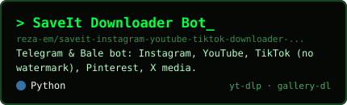</a></td>
<td align="center"><a href="https://github.com/reza-em/clapper-actor-resume-casting-telegram-bot">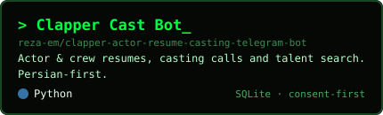</a></td>
</tr>
<tr>
<td align="center"><a href="https://github.com/reza-em/language-teacher-bot-chinese-german-russian">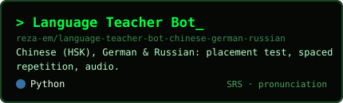</a></td>
<td align="center"><a href="https://github.com/reza-em/gym-fitness-coach-telegram-bale-bot">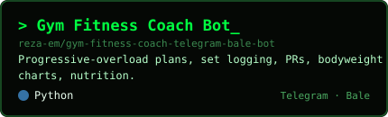</a></td>
</tr>
<tr>
<td align="center"><a href="https://github.com/reza-em/multi-platform-shop-chatbot-telegram-bale">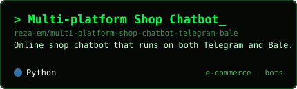</a></td>
<td align="center"><a href="https://github.com/reza-em/telegram-sticker-maker-bot">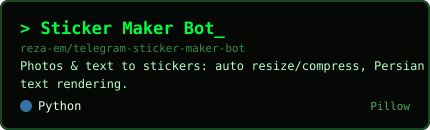</a></td>
</tr>
<tr>
<td align="center"><a href="https://github.com/reza-em/88-trader-mt5-forex-bot">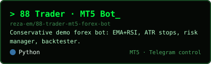</a></td>
<td align="center"><a href="https://github.com/reza-em/88-trader-server-fastapi">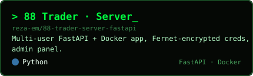</a></td>
</tr>
<tr>
<td align="center"><a href="https://github.com/reza-em/mrtrader-mt5-expert-advisor">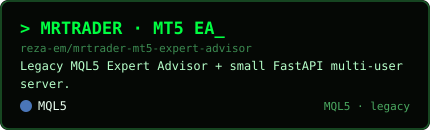</a></td>
<td align="center"><a href="https://github.com/reza-em/khodroyar-car-maintenance-app">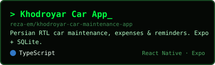</a></td>
</tr>
</table>
</div>
</details>

## `$ kaggle datasets list -u rezamaleki23`

📊 **[Persian Gym & Nutrition Programs](https://www.kaggle.com/datasets/rezamaleki23/persian-gym-nutrition-programs)** — the static knowledge base of the Gym Fitness Coach bot as clean CSVs: a 32-exercise library with Persian technique cues, a body-type program bank (fat loss / lean gain / fitness, men & women, 2–6 days/week), training phases, macro-calculator formulas and BMI rules. CC BY 4.0, no user data.

## `$ ./pipeline --watch`

<div align="center">


</div>

## `$ ./stats`

<div align="center">


</div>

## `$ ./terminal`

<div align="center">


</div>

## `$ tail -f interests.log`

- `[ok]`  Shipping bots that run 24/7 on Telegram and Bale
- `[ok]`  LLM features with safe fallbacks (no key → bot still works)
- `[lab]` Kubernetes, Ceph storage and distributed-systems experiments
- `[lab]` CI/CD, containers and infrastructure automation

## `$ ./contact`

Have a bot, automation or AI-integration project? **Let's talk.**

- 🐙 GitHub issues / discussions on any repo
- 📊 Kaggle: [rezamaleki23](https://www.kaggle.com/rezamaleki23)

<div align="center">

```
> while True: learn(); build(); ship()
```


</div>
